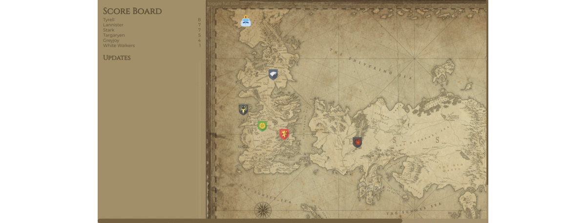

# The Known World

The Lannisters have taken over Kings Landing! Now all houses of the seven kingdoms declare war and head with their armies towards Kings Landing, to restore the order and be the next to sit on the Iron Throne.

### Mission
We would like you to continue working on our Vue.js web application that will help us monitor the armies activity in The Known World. You will receive updates on the army’s position and score and display them on a map. Once an army arrives to Kings Landing, the battle begin and the House with the higher score wins.

### Demo
In this round, notice the White Walkers army is the first to arrive to Kings Landing.
Since they gained a higher score then the Lannisters, they have won.

After refresh, a new game will start!

### Requirements - Client

1. Display all houses (by flag) on the map in their default positions.

2. Subscribe to updates (use the local service provided in the code as mock)

3. On a new update, calculate the house new position and move it on the map. If the house reaches kings landing, it will stop there.
    - Don't pass the destination: if the event states to proceed X steps, but the Lannisters are at a smaller distance,
      consider this house has reached the Lannisters and set the correct position.
    - On every event, houses gain score which should be added to their current score.

4. Determine the winner: the first house to reach Kings Landing will fight the Lannisters. The house with the higher score wins. Display a winner alert.

### Bonus Points

- Score Board: Display the list of houses sorted by score. The winner should be highlighted with bold text.
- Updates: Display a list of the incoming updates sorted from the latest -> oldest.

### Running your solution
Please use Gitpod to run the solution, so we can easily test it :)

